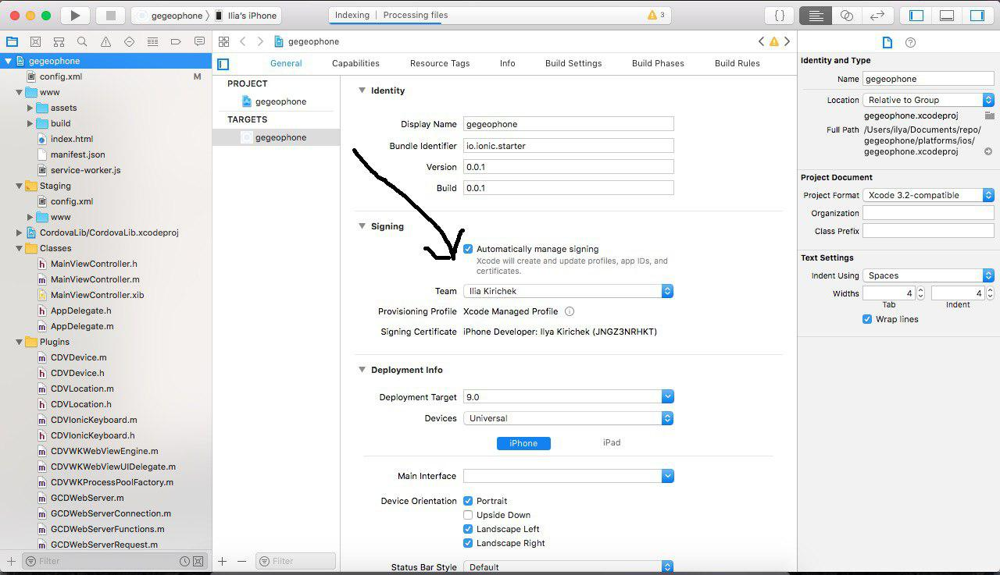
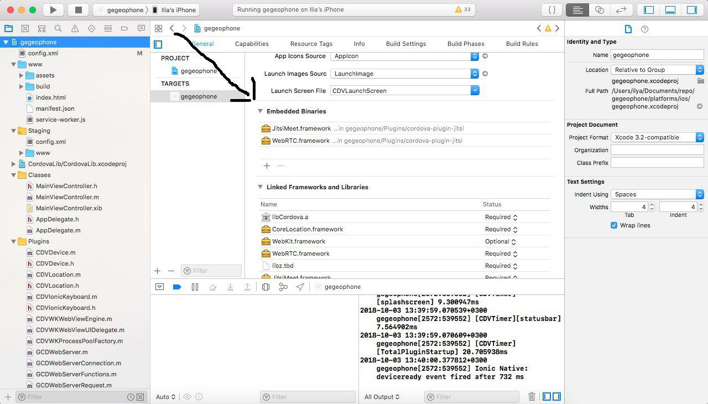
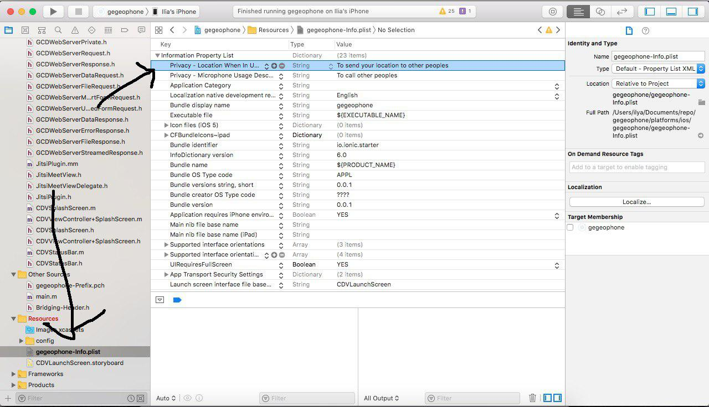

Installing from scratch
===
```bash
ionic start gegeophone
cd gegeophone

# устанавливаем мой форк плагина
ionic cordova plugin add https://github.com/mnill/cordova-plugin-jitsi-meet
 
# плагин геолокации
ionic cordova plugin add cordova-plugin-geolocation

# Работаем с разрешениями
ionic cordova plugin add cordova.plugins.diagnostic

# платформы
ionic cordova platform add android ios

# билдим андройд
ionic cordova build adndroid

# билдим айос
ionic cordova build ios --prod -- --buildFlag="-UseModernBuildSystem=0"
```

### ios fixes

видим ошибку code sign, идем в platforms/ios, открываем gegeophone.xcworkspace
выставляем sign команду, как на скрине, только свою(надо апл девелопер акк)



как на скрине включаем копирование фреймворков, jitsi и webrtc, в embedded binaries


идем в имя_проекта-info.plist и добавляем NSMicrophoneUsageDescription и NSLocationWhenInUseUsageDescription ключи с описанием, 
зачем нам нужен доступ к микрофону и геопозиции, без этого будет вылетать приложение. Если нужно видео в звонке, еще про камеру надо добавить.



### code

в скрипте где будем юзать плагин, сверху добовляем 
```typescript
declare var jitsiplugin:any;

// чтобы тайпскрипт видел объект и компилился, в методе
// звонок, wabalabadabadab - имя комнаты, true - не показывать фулскрин окно.

jitsiplugin.loadURL('https://meet.jit.si/wabalabadabadab', null,  true, (data) => {
  if (data === "CONFERENCE_WILL_LEAVE") {
    jitsiplugin.destroy((data) => {
      console.log("Destroy");
    }, (err) => {
      console.log("Error");
    });
  }
}, (err) => {
  console.log("Error : ", err);
});

// повесить трубку.
jitsiplugin.destroy();
```


### геопозиция
тут все просто
```typescript
declare var navigator:any;
navigator.geolocation.getCurrentPosition( (position) => {
      this.geoPosition = position.coords.latitude + ',' + position.coords.longitude;
    },  (error) => {
      alert('code: '    + error.code    + '\n' +
        'message: ' + error.message + '\n');
    });
````
или есть watch, чтобы следить, дока тут https://cordova.apache.org/docs/en/latest/reference/cordova-plugin-geolocation/#methods


# Работаем с разрешениями
```typescript
declare var cordova:any;

export class HomePage {

// ...

checkMicrophoneAndCall(id: number) {
    cordova.plugins.diagnostic.getMicrophoneAuthorizationStatus((status) => {
      if(status === cordova.plugins.diagnostic.permissionStatus.GRANTED) {
        this.call(id);
      } else if(
            (status === cordova.plugins.diagnostic.permissionStatus.NOT_REQUESTED && cordova.platformId.toLowerCase() === 'ios')
        ||  (status !== cordova.plugins.diagnostic.permissionStatus.DENIED_ALWAYS && cordova.platformId.toLowerCase() !== 'ios')
      ) {
        cordova.plugins.diagnostic.requestMicrophoneAuthorization((status) => {
            if (status === cordova.plugins.diagnostic.permissionStatus.GRANTED) {
              this.call(id);
            } else {
              alert("You denied access to record audio, please allow access to microphone in system settings to make audio calls");
            }
          }, function(error) {
            alert("The following error occurred: "+error);
          })
      } else {
        alert("You denied access to record audio, please allow access to microphone in system settings to make audio calls");
      }
    }, function(error) {
      alert("The following error occurred: "+error);
    });
  }
}
```
  
