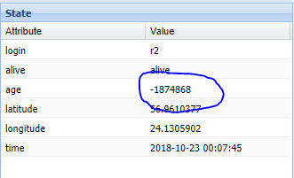
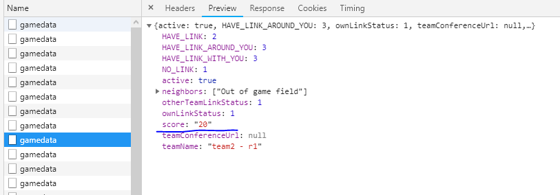

# URLs and credentials
#### Team interface
https://chainreactor.herokuapp.com

`team1/yellow`
`team2/green`

#### Player logins
* Team1
  * `t1/t1`
  * `t2/t2`

* Team2
  * `r1/r1`
  * `r2/r2`

# Задачи
## Подготовка
Собрать, запустить приложение. Залогиниться как `r1/r1`. Зайти в веб-админ как `team2`. Убедиться, что age  держится в пределах 5 (секунд с последней отсылки координат клиента). За отсылку отвечает [этот код](https://github.com/vermut/ChainSlave/blob/9e81097c5e2704236977ad25ffb40fe039f550af/src/pages/game/game.ts#L65).

Убедиться, что клиент регулярно [запрашивает обновления](https://github.com/vermut/ChainSlave/blob/9e81097c5e2704236977ad25ffb40fe039f550af/src/pages/game/game.ts#L87). В мобильном приложении должны расти цифры в заголовке. API запрос выглядит так: .

## Собственно задачи

1. Сделать, чтобы сообщения от клиента приходили даже тогда, когда сообщение работает в background. Проверка - age держится в пределах 5. [Код, который почему-то этого не делает.](https://github.com/vermut/ChainSlave/blob/9e81097c5e2704236977ad25ffb40fe039f550af/src/pages/game/game.ts#L77)
1. Настроить вибрацию. 
   1. Вибрировать во время логаута. [Код, который почему-то этого не делает.](https://github.com/vermut/ChainSlave/blob/9e81097c5e2704236977ad25ffb40fe039f550af/src/pages/game/game.ts#L101)
   1. Вибрировать каждый раз, когда score кратный 10 (эмуляция события с сервера).
1. Настроить нормальные сообщения об ошибках логина. Сейчас показывает `object Object`, должен показывать сообщение с сервера - `No such user` или что там придет.
1. Настроить нормальную обработку ошибок 500 с сервера. Сейчас он просто выпадает на логин.
1. Добавить статус Jitsi звонка - иконку [call](https://ionicframework.com/docs/ionicons/) в заголовок.
1. Добавить возможность пересоединиться к Jitsi - кнопку "Войти в чат", которая заново присоединяет людей в чат `wabalabadabadab`.
   1. Альтернатива, если это супер сложно - кнопку "Показать голосовой чат", которая просто покажет Jitsi панель с возможностью его снова спрятать.

